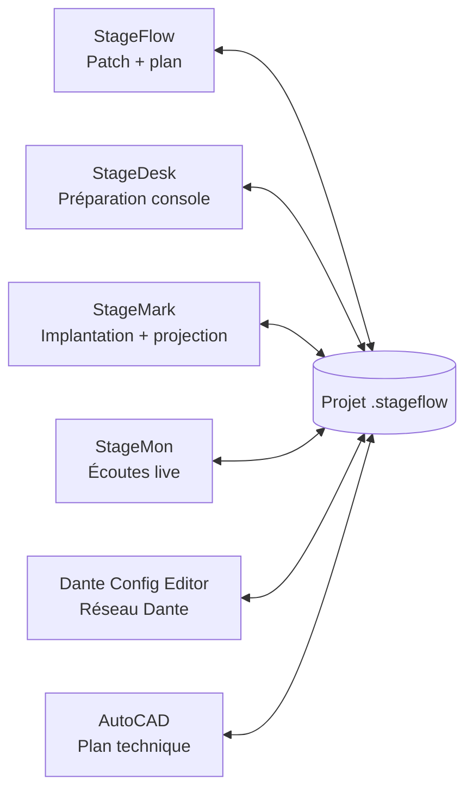

  

<h1 align="center">StageFlow v2027</h1>

  <strong>Préparez le patch, les groupes et le plan de scène dans un seul projet.</strong> 
  Gratuit · Hors ligne · Français / English · Windows / macOS

  <a href="https://github.com/Mamat79/StageFlow/releases/latest"><strong>⬇ Télécharger StageFlow</strong></a>

**[Windows v2027.0.5](https://github.com/Mamat79/StageFlow/releases/download/v2027.0.5/StageFlow-Setup.exe)** ·
**[Mac Apple Silicon v2027.0.3](https://github.com/Mamat79/StageFlow/releases/download/v2027.0.3/StageFlow-2027.0.3-macos-arm64.dmg)** ·
**[Mac Intel v2027.0.3](https://github.com/Mamat79/StageFlow/releases/download/v2027.0.3/StageFlow-2027.0.3-macos-x64.dmg)**

Les versions Windows et Mac sont livrées séparément. Le nom affiché reste
**StageFlow v2027** ; les numéros exacts ci-dessus identifient chaque paquet.

---

## Découvrir la suite en vidéo

[La suite - FR](https://github.com/Mamat79/StageFlow/releases/download/v2026.3/silemio-suite-fr.mp4) ·
[Sous-titres FR](https://github.com/Mamat79/StageFlow/releases/download/v2026.3/silemio-suite-fr.vtt) ·
[Suite video - EN](https://github.com/Mamat79/StageFlow/releases/download/v2026.3/silemio-suite-en.mp4) ·
[EN captions](https://github.com/Mamat79/StageFlow/releases/download/v2026.3/silemio-suite-en.vtt)

[StageFlow en 30 secondes - FR](https://github.com/Mamat79/StageFlow/releases/download/v2026.3/stageflow-presentation-fr.mp4) ·
[StageFlow in 30 seconds - EN](https://github.com/Mamat79/StageFlow/releases/download/v2026.3/stageflow-presentation-en.mp4)

Vidéos de découverte sans voix générée, avec captures de l'édition v2026.
Consultez les guides v2027 pour les écrans et limites de la nouvelle édition.
Discovery videos use v2026 screenshots; the v2027 guides describe this release.

## StageFlow, à quoi ça sert ?

StageFlow est un logiciel de préparation pour le show, la captation, le
broadcast et l'événementiel. Il rassemble dans un même projet le patch de
scène, les paires communes, les groupes de travail et un plan simple.

L'objectif est direct : **préparer une seule fois, imprimer ce dont chaque
équipe a besoin et éviter de ressaisir les mêmes informations dans plusieurs
logiciels**.

StageFlow peut être utilisé seul. Il peut aussi devenir le centre d'un flux
partagé avec StageDesk, StageMark, StageMon, Dante Config Editor et AutoCAD.
Chaque logiciel reste autonome et vous installez uniquement ceux dont vous avez
besoin.

## Un exemple concret

Vous préparez une scène avec 40 paires, cinq groupes et plusieurs lignes
communes :

1. choisissez le nombre de paires et de groupes — les choix rapides avancent
   par blocs de 20, mais vous pouvez saisir librement une autre valeur ;
2. saisissez les sources, micros et commentaires dans le tableau ;
3. placez les lignes communes dans la section partagée, puis décidez dans
   chaque groupe quelles paires communes doivent apparaître ;
4. utilisez le copier-coller ou tirez une sélection vers le bas pour prolonger
   une liste ;
5. exportez un classeur Excel avec une feuille par groupe et choisissez le papier et la pagination ;
6. dessinez les premiers éléments du plan ou poursuivez le travail dans
   AutoCAD ;
7. ouvrez le même projet dans les autres logiciels SiLeMIO si vous en avez
   besoin.

Vous gardez ainsi un seul dossier de projet au lieu de plusieurs documents qui
finissent par se contredire.

## Construire un patch à votre taille

- Choisir librement de 1 à 800 paires, avec des raccourcis 20, 40, 60, etc.
- Créer de 1 à 50 groupes.
- Ajouter des paires communes à tous les groupes.
- Voir les valeurs communes directement dans chaque groupe.
- Afficher ou masquer chaque paire commune, séparément pour chaque groupe.
- Utiliser **Tout afficher** ou **Tout masquer** pour régler un groupe en un clic.
- Modifier les cellules comme dans un tableur.
- Utiliser **Entrée** pour descendre et **Tab** pour passer à la cellule
  suivante, immédiatement prête à saisir.
- Copier et coller depuis ou vers Excel.
- Recopier une valeur ou prolonger une suite en tirant vers le bas.

## Préparer des feuilles faciles à imprimer

StageFlow génère un classeur Excel organisé par groupe. Chaque groupe possède
sa propre feuille. Sous Windows, choisissez A4, A3 ou un format proposé par
l'imprimante, puis une page par groupe ou plusieurs pages avec les titres répétés.
Pour un grand patch, le mode multipage évite une réduction excessive ; vérifiez
l'aperçu Excel avant d'imprimer ou d'exporter en PDF. Les
paires communes masquées dans un groupe restent également absentes de sa page,
tandis que les valeurs propres à ce groupe sont conservées.

Le résultat peut être corrigé dans Excel, imprimé, envoyé ou réimporté dans
StageFlow. Le libellé est **Balances** en français et **Sound check** en
anglais. Modifiez les noms de groupes et les horaires directement dans l'onglet
Commun : les pages imprimées les reprennent et StageFlow les conserve au réimport.

La **[notice StageFlow](https://www.silemio.com/logiciels/stageflow#guides)**
explique le logiciel pas à pas. Le bouton **Guide** l'ouvre dans votre langue ;
**Aide → Guide de la suite** présente les échanges avec les autres applications.

## Dessiner un plan de scène

L'éditeur de plan permet de poser les éléments essentiels d'une implantation,
d'exporter une image et de garder le plan avec le patch du show.

Si AutoCAD 2026 pour Windows est installé, le connecteur optionnel ajoute l'onglet
**SILEMI/O** et la commande **Patch StageFlow** pour poursuivre le plan
technique dans AutoCAD.

## Mode LIVE ou travail manuel

Sous Windows, ouvrez **Connexion StageFlow** (sur Mac : **Session StageFlow LIVE**)
lorsque StageFlow doit coordonner le show. Les pages
de groupes, labels, micros, commentaires et choix de paires communes sont alors
publiés automatiquement et les logiciels compatibles suivent le projet en
temps réel.

Coupez LIVE à tout moment pour revenir à un fonctionnement entièrement manuel :
**Enregistrer** et **Recharger** restent sous votre contrôle et chaque logiciel
continue de fonctionner seul. Une mise à jour StageMark ne déclenche jamais une
projection et une mise à jour Dante ne commande jamais le réseau en direct.

Sur plusieurs ordinateurs, StageFlow héberge le show sous Windows ou macOS. Chaque
logiciel compatible choisit volontairement cette session sur le réseau local
et entre le code à six chiffres. Le centre distingue les postes, logiciels et
mobiles connectés. Une déconnexion ne provoque pas de reconnexion automatique.

Les **alertes de labels** peuvent prévenir l'équipe pendant l'exploitation :
ancien nom, nouveau nom, origine et heure restent visibles jusqu'à
l'acquittement local. Chaque destinataire les reçoit par défaut mais peut les
désactiver pour lui seul. Le maître peut suspendre les notifications tout en
gardant LIVE actif ; les modifications faites pendant la pause ne sont pas
rejouées au retour.

## Un QR code, toutes les télécommandes

StageFlow peut devenir la console centrale du poste. Ouvrez **Connexion StageFlow
> Téléphones et tablettes** sous Windows, ou **Session StageFlow LIVE** sur Mac,
choisissez le réseau du téléphone et scannez un seul QR code. Le portail mobile
propose :

- le patch StageFlow, ses groupes et ses paires communes ;
- la télécommande complète de StageMark dans un onglet dédié ;
- la télécommande complète de StageMon dans un autre onglet.

StageFlow réutilise les véritables contrôleurs de StageMark et StageMon : vous
retrouvez les mêmes commandes et les mêmes sécurités. Un logiciel absent ou non
connecté au show reste simplement indisponible. Jusqu’à 24 téléphones ou
tablettes peuvent rejoindre la session simultanément, avec un acquittement des
alertes de labels propre à chaque appareil. Arrêter la télécommande StageFlow
révoque immédiatement la session.

## Piloter la suite depuis OSC, MIDI ou Stream Deck

StageFlow regroupe les commandes utiles de la suite dans un seul écran :

- recevez des commandes OSC et choisissez les retours d’état à renvoyer ;
- associez un bouton MIDI en l’actionnant une seule fois grâce au mode
  d’apprentissage ;
- installez directement le plugin Stream Deck fourni avec StageFlow ;
- utilisez les mêmes commandes pour changer de groupe, avancer dans les cues,
  lancer un BLACKOUT ou piloter les écoutes StageMon.

Tout reste facultatif. StageFlow, StageMark et StageMon continuent de fonctionner
seuls ; les commandes entre logiciels deviennent disponibles lorsqu’ils ont
rejoint le même projet LIVE.

## Un seul projet, plusieurs outils

Le projet `.stageflow` peut être sauvegardé, rouvert, copié sur un autre
ordinateur ou archivé avec le reste du dossier de production. StageFlow est
gratuit et facultatif : les autres logiciels peuvent ouvrir le projet commun
sans que StageFlow soit lancé.

📘 [Guide illustré en français](guides/Guide-Suite-SiLeMIO-FR.pdf) ·
[Illustrated guide in English](guides/SiLeMIO-Suite-Guide-EN.pdf)

- [StageDesk — transférer labels et réglages entre consoles et logiciels](https://github.com/Mamat79/StageDesk/releases/latest)
- [StageMark — dessiner, implanter et projeter des repères](https://github.com/Mamat79/StageMark/releases)
- [StageMon — préparer les écoutes et les piloter en direct](https://github.com/Mamat79/StageMon/releases/latest)
- [Dante Config Editor — préparer un réseau Dante hors ligne](https://github.com/Mamat79/Dante-Config-Editor/releases/latest)

## Installation Windows

1. Ouvrez la [dernière version](https://github.com/Mamat79/StageFlow/releases/latest).
2. Téléchargez `StageFlow-Setup.exe`.
3. Lancez l'installateur.
4. Cochez l'option AutoCAD uniquement si vous souhaitez installer le connecteur.

Le raccourci est **StageFlow v2027**. L'installateur ne ferme pas automatiquement
vos logiciels et préserve les projets et réglages utilisateur. Fermez StageFlow
vous-même après avoir enregistré avant de remplacer une version ouverte.

Le bouton **Guide** ouvre la notice de StageFlow dans votre langue.
**Aide → Guide de la suite** ouvre le guide commun ; **Aide** et la touche **F1**
ouvrent l'aide pratique de StageFlow. Le bandeau indique le thème
actuel, la langue, la connexion et les alertes ; les commandes se replient sur
une seconde ligne lorsque nécessaire. Les mises à jour sont accessibles dans
StageFlow.

## Installation macOS

StageFlow v2027.0.3 est disponible pour **macOS 14 ou ultérieur**, en deux éditions
autonomes : **Apple Silicon** (puces M) et **Intel**. Choisissez le téléchargement
adapté en haut de cette page, ouvrez le DMG et glissez **StageFlow.app** dans
Applications. Enregistrez et quittez une version déjà ouverte avant de la remplacer.
Le premier affichage peut demander une dizaine de secondes sur certains Mac Intel.

Préparez votre patch, votre classeur Excel et votre plan directement sur Mac,
ou hébergez une Session StageFlow LIVE pour les autres postes du réseau local.
Le mode compact garde la console sous la main ; sur un petit écran, la console
se replie pour laisser de la place au patch. Le plugin Stream Deck Mac est inclus.

📘 [Prise en main macOS — français et anglais](guides/StageFlow-macOS.html)
complète les guides communs de la suite. Elle précise les raccourcis Mac, les
commandes, les mises à jour et les différences d'ouverture des applications.

**Sécurité et limites :** cette édition possède une signature d'intégrité
ad-hoc, sans signature Developer ID ni notarisation Apple. macOS peut bloquer
son ouverture : vérifiez la source officielle et suivez uniquement la procédure
d'ouverture autorisée par macOS, sans désactiver ses protections globales.
Le connecteur AutoCAD reste réservé à AutoCAD 2026 Windows. Vérifiez MIDI,
Stream Deck, audio et projection sur votre propre matériel avant exploitation.
La corrective Windows 2027.0.5 ne modifie pas le paquet Mac 2027.0.4.

---

## English

### What is StageFlow for?

StageFlow is a free offline preparation tool for live events, broadcast,
recording and production work. It keeps the stage patch, shared lines, working
groups and a simple stage plan in one project.

The goal is simple: **prepare the information once, print the right sheet for
each team and avoid entering the same data in several applications**.

### Main features

- 1 to 800 pairs and 1 to 50 groups, with quick 20-pair increments.
- Shared values visible directly inside individual groups.
- Per-pair, per-group common-line visibility plus **Show all** and **Hide all**.
- Spreadsheet-style editing, copy/paste and smart fill.
- **Enter** moves down and **Tab** opens the next cell for immediate typing.
- Excel export and refresh; on Windows, A4/A3 and other available paper sizes,
  with one or multiple landscape pages per group and repeated headers.
- Localized Excel labels: **Balances** in French and **Sound check** in English.
- Built-in stage-plan editor and optional AutoCAD 2026 connector.
- French and English interface with built-in help from **Help** or `F1`.
- Local projects with no mandatory account, cloud or server.

StageFlow works on its own. The shared `.stageflow` project can also be opened
by StageDesk, StageMark, StageMon, Dante Config Editor and AutoCAD. Every
application remains fully standalone.

An explicit **StageFlow LIVE session** lets StageFlow coordinate compatible
applications, including computers on the same trusted local network. Each
client joins voluntarily with the host's six-digit code; disconnection never
silently reconnects. Turn LIVE off to restore manual Save/Reload operation.

Persistent label alerts show the old and new source name, origin and time.
Recipients receive them by default and acknowledge only their own alerts, or
turn reception off locally. The host may pause notifications without stopping
LIVE; changes made during the pause are not replayed.

One QR code can also open a unified phone portal: StageFlow patch controls in
the first tab, then the complete existing StageMark and StageMon remote
interfaces. Up to 24 phones or tablets can join simultaneously, with independent
label-alert acknowledgements. Each application keeps its own safety rules, and
stopping the StageFlow remote revokes the session immediately.

**[Download the latest StageFlow release](https://github.com/Mamat79/StageFlow/releases/latest)**

StageFlow also includes an OSC control centre, MIDI learn and an installable
Stream Deck plugin. The same command set can change StageFlow groups, move
through StageMark cues and operate the main StageMon listening controls while
the applications share a LIVE project.

On Windows 2027.0.5, **StageFlow connection** centralizes project/LIVE state,
workstations and QR access. **Guide** opens the StageFlow product manual;
**Help → Suite guide** opens the shared guide and **Help** opens practical help.
The header shows the current theme and language; alert
emission can be paused and resumed explicitly without replaying past changes.

This public repository contains Windows and macOS downloads. The source code is
maintained separately.

### Install on Mac

**macOS 14 or later** is supported by StageFlow v2027.0.3, with separate
[Apple Silicon](https://github.com/Mamat79/StageFlow/releases/download/v2027.0.3/StageFlow-2027.0.3-macos-arm64.dmg)
and [Intel](https://github.com/Mamat79/StageFlow/releases/download/v2027.0.3/StageFlow-2027.0.3-macos-x64.dmg)
downloads. Open the matching DMG and drag **StageFlow.app** into Applications.
Save and quit any previous version before replacing it.
The first window may take about ten seconds to appear on some Intel Macs.

Prepare patches, Excel workbooks and plans on Mac, or host a StageFlow LIVE
session for compatible Windows and Mac clients on your local network. The
suite console folds on small displays to keep the patch usable and remains
accessible in compact mode. The Mac Stream Deck plugin is included.

[Getting started on macOS — English / French](guides/StageFlow-macOS.html)
supplements the shared suite guides and explains Mac shortcuts, updates and
application-launch differences.

**Security and limits:** this edition is ad-hoc integrity-signed, not Developer
ID signed or Apple-notarized. macOS may block it: verify the official source
and use only the opening procedure permitted by macOS, without disabling
system-wide protection. The AutoCAD connector remains Windows-only. Check
MIDI, Stream Deck, audio and projection on your own hardware before live use.
The Windows 2027.0.5 corrective release does not change the macOS 2027.0.4 package.

---

<strong>SiLeMIO · By Mamat----[]---</strong>

